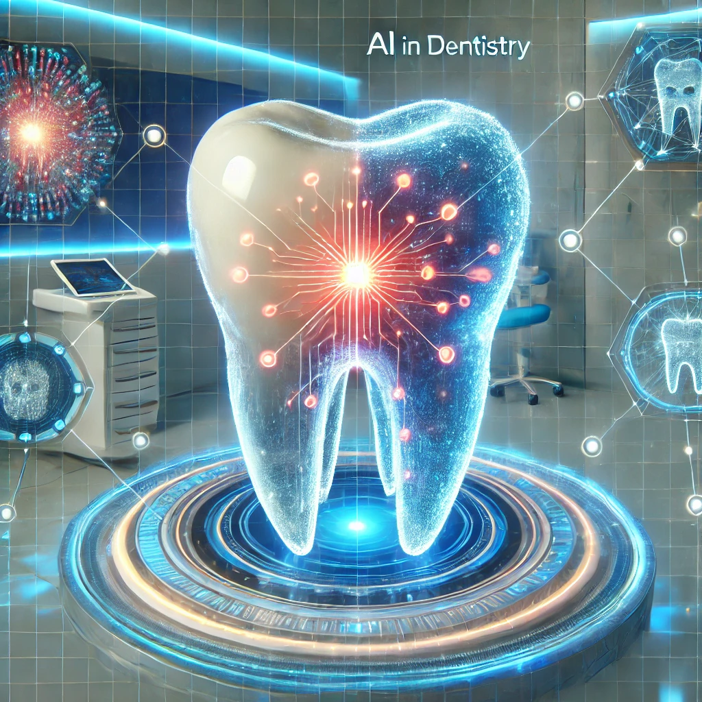

# Awesome AI in Dentistry 🦷

  

> A curated list of awesome resources for Artificial Intelligence in Dentistry research and applications.

Welcome to the **Awesome AI in Dentistry** repository! This is a comprehensive collection of research papers, datasets, open-source tools, and resources focused on the application of Artificial Intelligence in dental research and clinical practice.

There is much more to add, especially in areas like Reconstruction and emerging multimodal learning approaches. Contributions are very welcome!

## 📋 Table of Contents

- [News](#news)
- [Surveys & Reviews](#surveys--reviews)
- [Detection & Classification](#detection--classification)
- [Segmentation](#segmentation)
  - [CBCT Segmentation](#cbct-segmentation)
  - [IOS Segmentation](#ios-segmentation)
  - [OPG (X-ray) Segmentation](#opg-x-ray-segmentation)
- [Generation](#generation)
  - [Prosthesis Generation](#prosthesis-generation)
  - [Reconstruction](#reconstruction)
- [Orthodontic](#orthodontic)
- [Registration](#registration)
- [Multimodal & Vision-Language Models](#multimodal--vision-language-models)
- [Datasets & Benchmarks](#datasets--benchmarks)
- [Open Source Tools](#open-source-tools)
- [Standards & Guidelines](#standards--guidelines)
- [Contributing](#contributing)
- [License](#license)

---

## 📰 News

*Latest updates and milestones in AI Dentistry research*

| Date | Milestone | Details |
|------|-----------|---------|
| Jan 2025 | ADA Standard 1110-1 Approved | ANSI approval for AI image validation dataset guidance in dentistry |
| Dec 2025 | OralGPT-Omni Released | First dental-specialized MLLM for multimodal dental image analysis |
| Sep 2025 | MMOral Benchmark Released | Large-scale multimodal instruction dataset for panoramic X-ray analysis (20K+ images, 1.3M instances) |
| Jul 2025 | MMDental Dataset Published | Multimodal dataset with 660 patients combining CBCT and expert medical records in Nature Scientific Data |
| May 2025 | CBCT Segmentation Meta-Analysis | Evolution of deep learning for tooth segmentation reviewed across 30 studies |
| Jan 2025 | STS-Tooth Dataset Published | Largest multimodal tooth segmentation dataset (148K+ CBCT scans, 4K panoramic images) |

---

## 📚 Surveys & Reviews

| Year | Title | Publication | Links |
|-----:|:------|:------------|:------|
| 2025 | Deep Learning Applications in Dental Image-Based Diagnostics: A Systematic Review | Healthcare | [Paper](https://www.mdpi.com/2227-9032/13/12/1466) |
| 2025 | Integration of Artificial Intelligence in Dentistry: A Systematic Review of Educational and Clinical Implications | Cureus | [Paper](https://doi.org/10.7759/cureus.79350) |
| 2025 | Machine learning in dentistry: a scoping review | PLOS Digital Health | [Paper](https://doi.org/10.1371/journal.pdig.0000940) | 
| 2025 | Shaping the Future of Dental Education: A Scoping Review of Artificial Intelligence (AI) Integration Strategies | Cureus | [Paper](https://doi.org/10.7759/cureus.84921) |
| 2025 | Artificial Intelligence and its Implications in the Management of Orofacial Diseases - A Systematic Review | Open Dentistry Journal | [Paper](https://opendentistryjournal.com/VOLUME/19/ELOCATOR/e18742106349183/) |
| 2025 | The Role of AI in Modern Aesthetic Dentistry | Saudi Medical Journal | [Paper](https://saudijournals.com/articles/11886/) |
| 2025 | AI in Restorative Dentistry: Current Trends and Future Prospects | BMC Oral Health | [Paper](https://bmcoralhealth.biomedcentral.com/articles/10.1186/s12903-025-05989-1) |
| 2025 | Deep Learning in Dental Image Analysis: A Systematic Review of Datasets and Models | IEEE/arXiv | [Paper](https://arxiv.org/abs/2510.20634) |
| 2024 | Artificial intelligence in dentistry — A scoping review | J Oral Maxillofac Surg Med Pathol | [Paper](https://doi.org/10.1016/j.ajoms.2024.04.009)|
| 2024 | Applied artificial intelligence in dentistry: emerging data modalities and modeling approaches | Frontiers in AI | [Paper](https://www.frontiersin.org/articles/10.3389/frai.2024.1427517/full) |
| 2024 | Artificial intelligence in dentistry | British Dental Journal/FDI | [Paper](https://pmc.ncbi.nlm.nih.gov/articles/PMC11806333/) |
| 2023 | Evaluation of the Diagnostic and Prognostic Accuracy of Artificial Intelligence in Endodontic Dentistry: A Comprehensive Review of Literature | Comput Math Methods Med | [Paper](https://doi.org/10.1155/2023/7049360) |

---

## 🔍 Detection & Classification

*AI models for oral disease detection and classification*

| Year | Title | Publication | Links |
|-----:|:------|:------------|:------|
| 2025 | Clinical application of deep learning for enhanced caries detection on panoramic radiographs | Nature Scientific Reports | [Paper](https://www.nature.com/articles/s41598-025-16591-4) |
| 2025 | DORIS: An AI-powered dental charting system for panoramic radiographs | DDS Global Congress | [Paper](https://congress.digital-dentistry.org/keyword/deep-learning/) |
| 2025 | Application and performance of AI-based models in detection, segmentation and classification of periapical lesions: a systematic review | Frontiers in Digital Medicine | [Paper](https://www.frontiersin.org/articles/10.3389/fdmed.2025.1717343/full) |
| 2025 | A comparative analysis of deep learning models to aid novice dentists in detection of periapical lesions on periapical radiographs | BMC Oral Health | [Paper](https://www.ncbi.nlm.nih.gov/pmc/articles/PMC12107815/)  |
| 2025 | A Novel Approach using CapsNet and Deep Belief Network for Detection and Identification of Oral Leukopenia |  IEEE INOACC | [Paper](https://arxiv.org/abs/2501.00876)  |
| 2025 | Accuracy of artificial intelligence in caries detection: a systematic review and meta-analysis | Head & Face Medicine | [Paper](https://head-face-med.biomedcentral.com/articles/10.1186/s13005-025-00496-8) |
| 2025 | AI-Driven Dental Caries Management Strategies | International Dental Journal | [Paper](https://www.sciencedirect.com/science/article/pii/S0020653925001169)  |
| 2025 | Annotated intraoral image dataset for dental caries detection | Scientific Data | [Paper](https://www.nature.com/articles/s41597-025-05647-9) |
| 2025 | Artificial Intelligence to Assess Dental Findings from Panoramic Radiographs – A Multinational Study | arXiv | [Paper](https://arxiv.org/abs/2502.10277)  |
| 2025 | Deep Learning-Based Periapical Lesion Detection on Panoramic Radiographs—Validation of the Diagnocat System | Diagnostics | [Paper](https://www.mdpi.com/2075-4418/15/4/510)  |
| 2025 | Detection of caries and hypodontia using deep learning and explainable AI |  ICOSST | [Paper](https://www.researchgate.net/publication/388900888) |
| 2025 | Fully automated deep learning framework for detection and classification of impacted mandibular third molars in panoramic radiographs | JOMOS | [Paper](https://www.jomos.org/articles/mbcb/full_html/2025/01/mbcb240248/mbcb240248.html) |
| 2025 | The effectiveness of a novel artificial intelligence (AI) model in detecting oral and dental diseases | BDJ Open | [Paper](https://www.nature.com/articles/s41405-025-00336-6)|
| 2024 | Periapical lesion detection in periapical radiographs using YoCNET (Yolov5 + ConvNeXt integrated model) | Scientific Reports | [Paper](https://www.nature.com/articles/s41598-024-75748-9)  |
| 2024 | Segmentation of periapical lesions with automatic deep learning on panoramic radiographs: an artificial intelligence study | BMC Oral Health | [Paper](https://bmcoralhealth.biomedcentral.com/articles/10.1186/s12903-024-05126-4)|

---

## 🎯 Segmentation

### CBCT Segmentation

*Cone Beam Computed Tomography image segmentation*

| Year | Title | Publication | Links |
|-----:|:------|:------------|:------|
| 2025 | Evolution of deep learning tooth segmentation from CT/CBCT images: a systematic review and meta-analysis | BMC Oral Health | [Paper](https://bmcoralhealth.biomedcentral.com/articles/10.1186/s12903-025-05984-6) |
| 2025 | Shape-preserving Tooth Segmentation from CBCT Images Using Deep Learning with Semantic and Shape Awareness | arXiv | [Paper](https://arxiv.org/abs/2511.16936) |
| 2025 | An open deep learning-based framework and model for tooth instance segmentation in dental CBCT (OraSeg) | Clinical Oral Investigations | [Paper](https://link.springer.com/10.1007/s00784-025-06578-w) |
| 2025 | Tooth image segmentation and root canal measurement based on deep learning | Frontiers in Bioengineering and Biotechnology | [Paper](https://www.frontiersin.org/journals/bioengineering-and-biotechnology/articles/10.3389/fbioe.2025.1565403/full) |
| 2025 | A novel AI-powered tool for automated root canal segmentation on CBCT | International Endodontic Journal | [Paper](https://onlinelibrary.wiley.com/doi/10.1111/iej.14200) |
| 2025 | AI-based tool for automated segmentation of pulp cavity structures in maxillary premolars on CBCT | Scientific Reports | [Paper](https://doi.org/10.1038/s41598-025-86203-8) | 
| 2025 | Comparison of 2D, 2.5D, and 3D segmentation networks for mandibular canals in CBCT images | BMC Oral Health | [Paper](https://bmcoralhealth.biomedcentral.com/articles/10.1186/s12903-025-06483-4) |
| 2025 | GEPAR3D: Geometry Prior-Assisted Learning for 3D Tooth Segmentation | MICCAI 2025 | [Paper](https://arxiv.org/abs/2508.00155) • [Code](https://github.com/tomek1911/GEPAR3D) |
| 2025 | Novel AI-based tool for primary tooth segmentation on CBCT using CNNs: a validation study | International Journal of Paediatric Dentistry | [Paper](https://doi.org/10.1111/ipd.13204) |
| 2025 | Accurate 3D Tooth Segmentation via Skeleton and Centroid Guidance in CBCT Imaging | IEEE | [Paper](https://ieeexplore.ieee.org/document/10920685/) |
| 2025 | Deep learning-assisted CBCT segmentation provides reliable volumetric assessment of mandibular defects | Nature Scientific Reports | [Paper](https://www.nature.com/articles/s41598-025-24748-4) |
| 2025 | A novel artificial intelligence-powered tool for automated root canal segmentation in single-rooted teeth on CBCT | International Endodontic Journal | [Paper](https://pmc.ncbi.nlm.nih.gov/articles/PMC11891948/) |
| 2025 | Multimodal Contrastive Pretraining of CBCT and IOS for Enhanced Tooth Segmentation (ToothMCL) | arXiv | [Paper](https://arxiv.org/abs/2509.07923) |
| 2025 | Tooth segmentation on multimodal images using adapted SAM (Tooth-ASAM) | Nature Scientific Reports | [Paper](https://www.nature.com/articles/s41598-025-96301-2) |
| 2024 | A Multi-Stage Framework for 3D Individual Tooth Segmentation in Dental CBCT | arXiv | [Paper](https://arxiv.org/pdf/2407.10433v1)
| 2024 | Artificial intelligence system for automatic maxillary sinus segmentation on CBCT (nnU-Net v2) | Dentomaxillofacial Radiology | [Paper](https://academic.oup.com/dmfr/article/53/4/256/7632098) |
| 2024 | Automatic jawbone structure segmentation on dental CBCT images via deep learning | Clinical Oral Investigations | [Paper](https://link.springer.com/article/10.1007/s00784-024-06061-y)
| 2024 | Automatic mandibular semantic segmentation of teeth, pulp cavity, root canals, and IAN on Pulpy3D (CBCT) | MICCAI | [Paper](https://papers.miccai.org/miccai-2024/paper/1419_paper.pdf) |
| 2024 | Automatic maxillary sinus segmentation and pathology classification on CBCT using deep learning (YOLOv5x) | BMC Oral Health | [Paper](https://bmcoralhealth.biomedcentral.com/articles/10.1186/s12903-024-04924-0) |
| 2024 | Automatic segmentation of the maxillary sinus on CBCT with U-Net | European Archives of Oto-Rhino-Laryngology | [Paper](https://link.springer.com/article/10.1007/s00405-024-08870-z) |
| 2024 | DentalSegmentator: Robust open source deep learning-based CT and CBCT image segmentation | Journal of Dentistry | [Paper](https://www.sciencedirect.com/science/article/pii/S0300571224002999) |
| 2024 | Machine-learning-assisted 5-part tooth segmentation for forensic dental age estimation | J. of Forensic Odonto-stomatology | [Paper](https://pubmed.ncbi.nlm.nih.gov/38742569/) |
| 2024 | MRCM-UCTransNet for accurate 3D tooth segmentation from CBCT | Int. J. of Imaging Systems and Technology | [Paper](https://doi.org/10.1002/ima.23139) |
| 2024 | Sparse Anatomical Prompt Semi-Supervised Learning With Masked Image Modeling for CBCT Tooth Segmentation | IEEE ISBI | [Paper](https://ieeexplore.ieee.org/document/10635166) |
| 2024 | T-Mamba: A unified framework with Long-Range Dependency in dual-domain for 2D & 3D tooth segmentation | arXiv | [Paper](https://arxiv.org/pdf/2404.01065) • [Code](https://github.com/isbrycee/T-Mamba) |
| 2024 | Trans-VNet: Transformer-based tooth semantic segmentation in CBCT images | Biomedical Signal Processing and Control | [Paper](https://doi.org/10.1016/j.bspc.2024.106666) |
| 2024 | Two-Stage Semi-supervised nnU-Net Framework for Tooth Segmentation in CBCT Images | MICCAI Challenge | [Paper](https://dl.acm.org/doi/10.1007/978-3-031-88977-6_10)
| 2024 | MICCAI STS 2024 Challenge: Semi-Supervised Instance-Level Tooth Segmentation in Panoramic X-ray and CBCT | MICCAI | [Paper](https://arxiv.org/abs/2511.22911) |
| 2024 | Automated Cone Beam Computed Tomography Segmentation of Multiple Impacted Teeth | Orthodontics & Craniofacial Research | [Paper](https://onlinelibrary.wiley.com/doi/10.1111/ocr.12890) |
| 2023 | Age estimation based on 3D pulp segmentation of first molars from CBCT (U-Net) | Forensic Imaging | [PMC](https://pmc.ncbi.nlm.nih.gov/articles/PMC10552131/) |
| 2023 | Automatic Segmentation of Internal Tooth Structure from CBCT Images Using Hierarchical Deep Learning | MICCAI | [Paper](https://link.springer.com/chapter/10.1007/978-3-031-43898-1_67) |
| 2023 | Deep learning-based segmentation of the mandibular canals in cone-beam CT reaches human-level performance | Dentomaxillofac Radiol | [Paper](https://pubmed.ncbi.nlm.nih.gov/39932925/) |
| 2023 | THISNet: Tooth Instance Segmentation on 3D Dental Models via Highlighting Tooth Regions | IEEE TCSVT | [Paper](https://ieeexplore.ieee.org/document/10353988) • [Code](https://github.com/li-pengcheng/THISNet) |
| 2023 | Tooth Automatic Segmentation from CBCT Images: a Systematic Review | Clinical Oral Investigations | [Paper](https://link.springer.com/article/10.1007/s00784-023-05048-5) |
| 2022 | A fully automatic AI system for tooth and alveolar bone segmentation from cone-beam CT images | Nature Communications | [Paper](https://www.nature.com/articles/s41467-022-29637-2) • [Code](https://github.com/ErdanC/Tooth-and-alveolar-bone-segmentation-from-CBCT) |
| 2022 | Automatic multi-anatomical skull structure segmentation of cone-beam computed tomography scans using 3D UNETR | PLOS ONE | [Paper](https://journals.plos.org/plosone/article?id=10.1371/journal.pone.0275033) |
| 2022 | Automatic Segmentation of Individual Tooth in Dental CBCT Images From Tooth Surface Map by a Multi-Task FCN | IEEE Access | [Paper](https://ieeexplore.ieee.org/document/9083982) |
| 2022 | CTooth+: A Large-Scale Dental Cone Beam Computed Tomography Dataset and Benchmark for Tooth Volume Segmentation | DALI Workshop | [Paper](https://link.springer.com/chapter/10.1007/978-3-031-17027-0_7) |
| 2022 | Deep segmentation of the mandibular canal: a new 3D annotated dataset of CBCT volumes | IEEE Access | [Paper](https://ui.adsabs.harvard.edu/abs/2022IEEEA..1011500C/abstract) |
| 2022 | Improving performance of deep learning models for segmentation of teeth in CBCT using 3.5D U-Net | Scientific Reports | [Paper](https://www.nature.com/articles/s41598-022-23901-7) |
| 2022 | Semantic Graph Attention With Explicit Anatomical Association Modeling For Tooth Segmentation From CBCT Images | IEEE TMI | [Paper](https://ieeexplore.ieee.org/document/9785606) |
| 2022 | Tooth Instance Segmentation From Cone-Beam CT Images Through Point-Based Detection And Gaussian Disentanglement | Multimedia Tools and Applications | [Paper](https://link.springer.com/article/10.1007/s11042-022-12524-9) |
| 2021 | A Fully Automated Method For 3D Individual Tooth Identification And Segmentation In Dental CBCT | IEEE TPAMI | [Paper](https://ieeexplore.ieee.org/document/9445658) |
| 2021 | Hierarchical Morphology-Guided Tooth Instance Segmentation from CBCT Images | IPMI | [Paper](https://link.springer.com/chapter/10.1007/978-3-030-78191-0_12) |
| 2021 | Refined tooth and pulp segmentation using U-Net in CBCT images | Dentomaxillofacial Radiology | [Paper](https://doi.org/10.1259/dmfr.20200251) |
| 2020 | Center-Sensitive and Boundary-Aware Tooth Instance Segmentation and Classification from Cone-Beam CT | IEEE ISBI | [Paper](https://ieeexplore.ieee.org/document/9098542) |
| 2020 | Pose-Aware Instance Segmentation Framework From Cone Beam CT Images For Tooth Segmentation | Computers in Biology and Medicine | [Paper](https://www.sciencedirect.com/science/article/pii/S0010482520301050) |
| 2019 | Automatic Image Annotation and Deep Learning for Tooth CT Image Segmentation | IGTA | [Paper](https://link.springer.com/chapter/10.1007/978-3-030-34110-7_43) |
| 2018 | Coarse-To-Fine Volumetric Segmentation Of Teeth In Cone-Beam CT | IEEE ISBI | [Paper](https://ieeexplore.ieee.org/document/8759310) |
| 2018 | ToothNet: Automatic Tooth Instance Segmentation and Identification from Cone Beam CT Images | CVPR | [Paper](https://openaccess.thecvf.com/content_CVPR_2019/papers/Cui_ToothNet_Automatic_Tooth_Instance_Segmentation_and_Identification_From_Cone_Beam_CVPR_2019_paper.pdf) • [Blog](https://enigma-li.github.io/projects/toothSeg/toothNet.html) |

### IOS Segmentation

*Intraoral Scanner segmentation*

| Year | Title | Publication | Links |
|-----:|:-----|:-----|:-----|
| 2025 | 3D Dental Model Segmentation with Geometrical Boundary Awareness (CrossTooth) | CVPR | [Paper](https://arxiv.org/abs/2503.23702) |
| 2025 | Multimodal Contrastive Pretraining of CBCT and IOS for Enhanced Tooth Segmentation (ToothMCL) | arXiv | [Paper](https://arxiv.org/abs/2509.07923) |
| 2025 | ChatIOS: Improving automatic 3-dimensional tooth segmentation via GPT-4V and multimodal pre-training | Journal of Dentistry | [Paper](https://pubmed.ncbi.nlm.nih.gov/40228651/) |
| 2025 | Cross-center Model Adaptive Tooth Segmentation | Medical Image Analysis (MIA) | [Paper](https://www.sciencedirect.com/science/article/pii/S1361841524003682) |
| 2025 | Fully automated tooth segmentation and labeling for both full- and partial-arch intraoral scans using deep learning | International Dental Journal | [Paper](https://doi.org/10.1016/j.identj.2025.100950) |
| 2025 | TSegLab: Multi-stage 3D Dental Scan Segmentation and Labeling | Computers in Biology and Medicine | [Paper](https://pubmed.ncbi.nlm.nih.gov/39778366/) • [Project](https://crns-smartvision.github.io/tseglab/) |
| 2025 | Unsupervised tooth segmentation from 3D dental arch scans using domain adaptation of synthetic data | International Journal of Medical Informatics | [Paper](https://www.sciencedirect.com/science/article/pii/S1386505624004325) |
| 2025 | A multiview AI segmentation of 3D dental scans | Scientific Data | [Paper](https://www.sciencedirect.com/science/article/pii/S2212443825008318) |
| 2025 | Development and Validation of an AI-Driven Automated Tooth Segmentation from Intraoral Scans | OpenReview | [Paper](https://openreview.net/forum?id=ulx7du7vmR) |
| 2024 | Convolutional Neural Network for Automated Tooth Segmentation on Intraoral Scans | BMC Oral Health | [Paper](https://bmcoralhealth.biomedcentral.com/articles/10.1186/s12903-024-04582-2) |
| 2024 | DBGANet: Dual-Branch Geometric Attention Network for Accurate 3D Tooth Segmentation | IEEE TCSVT | [Paper](https://ieeexplore.ieee.org/document/10313281) • [Code](https://github.com/zhijieL513/DBGANet) |
| 2024 | DentalModelSeg: Fully Automated Segmentation of Upper and Lower 3D Intra-oral Surfaces | IEEE ISBI | [Paper](https://pmc.ncbi.nlm.nih.gov/articles/PMC10949221/) |
| 2024 | DilatedToothSegNet: Tooth Segmentation Network on 3D Dental Meshes Through Increasing Receptive Vision | Journal of Digital Imaging | [Paper](https://link.springer.com/article/10.1007/s10278-024-01061-6) • [Code](https://github.com/LucasKre/dilated_tooth_seg_net) |
| 2024 | IOSSAM: Label Efficient Multi-view Prompt-Driven Tooth Segmentation | MICCAI | [Paper](https://papers.miccai.org/miccai-2024/paper/2519_paper.pdf) • [Code](https://github.com/ar-inspire/IOSSAM) |
| 2024 | Mesh Segmentation for Individual Teeth Based on Two-Stream GCN with Self-Attention | IEEE Access | [Paper](https://ieeexplore.ieee.org/document/10534800) |
| 2024 | PointRegion: Transformer-based 3D Tooth Segmentation via Point Cloud Region Partition | Scientific Reports | [Paper](https://www.nature.com/articles/s41598-024-79485-x) |
| 2024 | Self-Supervised Learning with Masked Autoencoders for Teeth Segmentation from Intra-oral 3D Scans | WACV | [Paper](https://openaccess.thecvf.com/content/WACV2024/papers/Almalki_Self-Supervised_Learning_With_Masked_Autoencoders_for_Teeth_Segmentation_From_Intra-Oral_WACV_2024_paper.pdf) |
| 2024 | Teeth-SEG: An Efficient Instance Segmentation Framework for Orthodontic Treatment based on Multi-Scale Aggregation | CVPR | [Paper](https://openaccess.thecvf.com/content/CVPR2024/papers/Zou_Teeth-SEG_An_Efficient_Instance_Segmentation_Framework_for_Orthodontic_Treatment_based_CVPR_2024_paper.pdf) • [Project](https://zoubo9034.github.io/TeethSEG/) |
| 2024 | TSRNet: A Dual-Stream Network for Refining 3D Tooth Segmentation | IEEE TVCG | [Paper](https://www.computer.org/csdl/journal/tg/5555/01/10562232/1XSjybNynBe) |
| 2024 | When 3D Partial Points Meets SAM: Tooth Point Cloud Segmentation with Sparse Labels (SAMTooth) | MICCAI | [Paper](https://papers.miccai.org/miccai-2024/paper/0843_paper.pdf) • [Code](https://github.com/CUHK-AIM-Group/SAMTooth) |
| 2023 | Model Adaptive Tooth Segmentation | MIDL | [Paper](https://openreview.net/forum?id=O2DerS5oQ1) |
| 2023 | MPCNet: Improved MeshSegNet Based on Position Encoding and Channel Attention | IEEE Access | [Paper](https://ieeexplore.ieee.org/document/10063862) |
| 2023 | Robust Hybrid Learning for Automatic Teeth Segmentation and Labeling on 3D Dental Models | IEEE TMM | [Paper](https://ieeexplore.ieee.org/document/10169899) |
| 2023 | TeethGNN: Semantic 3D Teeth Segmentation with Graph Neural Networks | IEEE TVCG | [Paper](https://dl.acm.org/doi/abs/10.1109/TVCG.2022.3153501) |
| 2023 | TSegFormer: 3D Tooth Segmentation in Intraoral Scans with Geometry-Guided Transformer | MICCAI | [Paper](https://link.springer.com/chapter/10.1007/978-3-031-43987-2_41) • [Code](https://github.com/huiminxiong/TSegFormer) |
| 2022 | 3DTeethSeg'22: 3D Teeth Scan Segmentation and Labeling Challenge | MICCAI Challenge | [Paper](https://arxiv.org/abs/2305.18277) • [Code](https://github.com/abenhamadou/3DTeethSeg22_challenge) |
| 2022 | DArch: Dental Arch Prior-Assisted 3D Tooth Instance Segmentation with Weak Annotations | CVPR | [Paper](https://openaccess.thecvf.com/content/CVPR2022/html/Qiu_DArch_Dental_Arch_Prior-Assisted_3D_Tooth_Instance_Segmentation_With_Weak_CVPR_2022_paper.html)|
| 2022 | Semi-Supervised Segmentation of Tooth from 3D Scanned Dental Arches | SPIE Medical Imaging | [Paper](https://www.spiedigitallibrary.org/conference-proceedings-of-spie/12032/120322W/Semi-supervised-segmentation-of-tooth-from-3D-scanned-dental-arches/10.1117/12.2612655.short) • [Code](https://github.com/Alsheghri/Teeth-Segmentation) |
| 2022 | Two-Stage Mesh Deep Learning for Automated Tooth Segmentation and Landmark Localization on 3D Intraoral Scans | IEEE TMI | [Paper](https://pmc.ncbi.nlm.nih.gov/articles/PMC10547011/) |
| 2022 | Two-Stream Graph Convolutional Network for Intra-oral Scanner Image Segmentation | arXiv | [Paper](https://arxiv.org/abs/2204.08797) |
| 2022 | Unsupervised Pre-training Improves Tooth Segmentation in 3D Intraoral Mesh Scans | PMLR | [Paper](https://proceedings.mlr.press/v172/he22b.html) • [Code](https://github.com/zju-ai4h/Unsupervised-Pretraining-for-tooth-segmentation) |
| 2021 | 3D Dental Model Segmentation with Graph Attentional Convolution Network | Pattern Recognition Letters | [Paper](https://www.sciencedirect.com/science/article/pii/S0167865521003172) |
| 2021 | Mask-MCNet: Tooth Instance Segmentation in 3D Point Clouds of Intra-oral Scans | Neurocomputing | [Paper](https://www.sciencedirect.com/science/article/pii/S0925231221001041) |
| 2021 | TSegNet: An Efficient and Accurate Tooth Segmentation Network on 3D Dental Model | Medical Image Analysis (MIA) | [Paper](https://www.sciencedirect.com/science/article/abs/pii/S1361841520303133) |
| 2020 | Deep Multi-Scale Mesh Feature Learning for Automated Labeling of Raw Dental Surfaces from 3D Intraoral Scanners (MeshSegNet) | IEEE TMI | [Paper](https://ieeexplore.ieee.org/document/8984309) • [Code](https://github.com/XiShuFan/MeshSegNet) |
| 2019 | 3D Tooth Segmentation and Labeling Using Deep Convolutional Neural Networks | IEEE TVCG | [Paper](https://doi.org/10.1109/TVCG.2018.2839685) |
| 2019 | MeshSegNet: Deep Multi-scale Mesh Feature Learning for End-to-End Tooth Labeling on 3D Dental Surfaces | MICCAI | [Paper](https://link.springer.com/chapter/10.1007/978-3-030-32226-7_93) • [Code](https://github.com/XiShuFan/MeshSegNet) |
| 2014 | Tooth segmentation on dental meshes using morphologic skeleton | Computers & Graphics | [Paper](https://www.sciencedirect.com/science/article/pii/S0097849313001696) |

### OPG (X-ray) Segmentation

*Panoramic X-ray image segmentation*

| Year | Title | Publication | Links |
|-----:|:------|:-----------|:------|
| 2025 | Enhanced Pediatric Dental Segmentation Using a Custom SegUNet with VGG19 Backbone on Panoramic Radiographs | arXiv | [Paper](https://arxiv.org/abs/2503.06321) |
| 2025 | Segmentation of Pulp and Pulp Stones with Automatic Deep Learning in Panoramic Radiographs | Dentistry Journal | [Paper](https://pmc.ncbi.nlm.nih.gov/articles/PMC12191843/) |
| 2025 | Tooth segmentation in panoramic dental radiographs using U-Net variants and DeepLabV3 | Discover Applied Sciences | [Paper](https://link.springer.com/article/10.1007/s42452-025-06606-0) |
| 2025 | U-Net-Based Deep Learning for Simultaneous Tooth Segmentation and Agenesis Detection on Panoramic Radiographs | Healthcare | [Paper](https://pmc.ncbi.nlm.nih.gov/articles/PMC12562461/) |
| 2024 | A Semi-Supervised Transformer-Based Deep Learning Framework for Automated Tooth Segmentation and Identification on Panoramic Radiographs | Diagnostics | [DOI](https://doi.org/10.3390/diagnostics14171948) |
| 2024 | CariSeg: Teeth segmentation and carious lesion detection in dental X-rays | Heliyon | [Paper](https://www.sciencedirect.com/science/article/pii/S2405844024068671) |
| 2024 | OralBBNet: Spatially Guided Dental Segmentation of Panoramic X-Rays with Bounding Box Priors | arXiv | [Paper](https://arxiv.org/abs/2406.03747) |
| 2024 | SE-IB-ED: Squeeze and Excitation Inception Block-based Encoder–Decoder network for teeth segmentation in panoramic X-ray images | Diagnostics | [Paper](https://pmc.ncbi.nlm.nih.gov/articles/PMC11640077/) |
| 2024 | ViSTooth: A Visualization Framework for Tooth Segmentation on Panoramic Radiograph | arXiv | [Paper](https://arxiv.org/abs/2405.08573) |
| 2024 | YOLO-V5 based deep learning approach for tooth detection and segmentation on pediatric panoramic radiographs in mixed dentition | BMC Medical Imaging | [Paper](https://bmcmedimaging.biomedcentral.com/articles/10.1186/s12880-024-01338-w) |
| 2023 | A Deep Learning Approach to Teeth Segmentation and Orientation from Panoramic X-rays | arXiv | [Paper](https://arxiv.org/abs/2310.17176) |
| 2023 | Teeth Segmentation in Panoramic Dental X-ray Using Mask-RCNN | Applied Sciences | [Paper](https://doi.org/10.3390/app13137947) |

---

## Generation

### Prosthesis Generation

| Year | Title | Publication | Links |
|-----:|:-----|:-----|:-----|
| 2025 | CrownGen: Patient-customized Crown Generation via Point Diffusion Model | arXiv | [Paper](https://arxiv.org/abs/2512.21890) • [Code](https://github.com/baejustin/CrownGen)|
| 2025 | Diff-TRGN: Diffusion-based tooth root generation network with clinical guidance | Computers & Graphics | [Paper](https://www.sciencedirect.com/science/article/pii/S0097849325001815) |
| 2025 | DCrownFormer+: Morphology-aware mesh generation and refinement transformer for dental crown prosthesis | Medical Image Analysis | [Paper](https://www.sciencedirect.com/science/article/pii/S1361841525002646) |
| 2025 | Personalized Dental Crown Design: A Point-to-Mesh Generation for Dental Crown Prosthesis | Medical Image Analysis | [Paper](https://www.sciencedirect.com/science/article/pii/S1361841524003645) |
| 2025 | ToothForge: Automatic Dental Shape Generation using Synchronized Spectral Embeddings | IPMI | [Paper](https://arxiv.org/pdf/2506.02702) |
| 2025 | VBCD: A Voxel-Based Crown Design Framework | arXiv | [Paper](https://www.arxiv.org/pdf/2507.17205) |
| 2024 | A Data-Driven Approach for the Partial Reconstruction of Individual Human Molar Teeth Using Generative Deep Learning | Frontiers in Artificial Intelligence | [Paper](https://www.frontiersin.org/articles/10.3389/frai.2024.1339193/full) |
| 2024 | Conditional Diffusion Guided by Part-Level Latent for Dental Crown Point-Cloud Generation | SPIE Medical Imaging | [Paper](https://www.spiedigitallibrary.org/conference-proceedings-of-spie/13180/1318022/) |
| 2024 | DCrownFormer: Morphology-Aware Point-to-Mesh Generation Transformer for Dental Crown Prosthesis | MICCAI | [Paper](https://link.springer.com/chapter/10.1007/978-3-031-72089-5_11) • [Code](https://github.com/suyang93/DCrownFormer/) |
| 2024 | Feasibility of Using Two Generative AI Models for Teeth Reconstruction | Journal of Dentistry | [Paper](https://www.sciencedirect.com/science/article/abs/pii/S0300571224005803) |
| 2023 | 3D Reconstruction for Maxillary Anterior Tooth Crown Based on Shape and Pose Estimation Networks | IJCARS | [Paper](https://link.springer.com/article/10.1007/s11548-023-02841-1) |
| 2023 | Computer-Aided Design and 3-Dimensional Artificial/Convolutional Neural Network for Digital Partial Dental Crown Synthesis | Scientific Reports | [Paper](https://www.nature.com/articles/s41598-023-28442-1) |
| 2023 | From Mesh Completion to AI Designed Crown | MICCAI | [Paper](https://link.springer.com/chapter/10.1007/978-3-031-43996-4_53) • [Code](https://github.com/Golriz-code/DMC) |
| 2023 | Image Generation Technology for Functional Occlusal Pits and Fissures Based on a Conditional Generative Adversarial Network | PLoS ONE | [Paper](https://pubmed.ncbi.nlm.nih.gov/37725620/) |
| 2023 | Improving the Quality of Dental Crown Using a Transformer-Based Method | arXiv | [Paper](https://arxiv.org/abs/2303.02426) |
| 2023 | Morphology and Mechanical Performance of Dental Crown Designed by 3D-DCGAN | Dental Materials | [Paper](https://www.sciencedirect.com/science/article/pii/S0109564123000416) |
| 2022 | A Dual Discriminator Adversarial Learning Approach for Dental Occlusal Surface Reconstruction | Journal of Healthcare Engineering | [Paper](https://pmc.ncbi.nlm.nih.gov/articles/PMC9018184/) |
| 2022 | DCPR-GAN: Dental Crown Prosthesis Restoration Using Two-Stage Generative Adversarial Networks | IEEE JBHI | [Paper](https://pubmed.ncbi.nlm.nih.gov/34637385/) |
| 2021 | Efficient Computer-Aided Design of Dental Inlay Restoration: A Deep Adversarial Framework (DAIS) | IEEE TMI | [Paper](https://pubmed.ncbi.nlm.nih.gov/33945473/) |
| 2020 | Personalized Design Technique for the Dental Occlusal Surface Based on Conditional GANs | IJNMBE | [Paper](https://pubmed.ncbi.nlm.nih.gov/32043311/) |
| 2018 | Learning Beyond Human Expertise with Generative Models for Dental Restorations | arXiv | [Paper](https://arxiv.org/abs/1804.00064) |

### Reconstruction

| Year | Title | Publication | Links |
|-----:|:-----|:-----|:-----|
| 2025 | 3D Dynamic Prediction of Missing Teeth in Diverse Patterns via Diffusion | MICCAI | [Paper](https://papers.miccai.org/miccai-2025/0003-Paper2258.html) |

---

## Orthodontic

| Year | Title | Publication | Links |
|-----:|:-----|:-----|:-----|
| 2025 | CLIK-Diffusion: Clinical Knowledge-informed Diffusion Model for Tooth Alignment | Medical Image Analysis | [Paper](https://www.sciencedirect.com/science/article/abs/pii/S1361841525002932) |
| 2025 | DyOrthoAlign: A Dynamic Arrangement Framework for Automatic Tooth Alignment | Computer Aided Geometric Design | [Paper](https://www.sciencedirect.com/science/article/abs/pii/S0167839625000251) |
| 2025 | Force-Driven Model for Automated Clear Aligner Staging | Bioengineering | [Paper](https://pmc.ncbi.nlm.nih.gov/articles/PMC11852307/) |
| 2025 | LETA: Tooth Alignment Prediction Based on Dual-branch Latent Encoding | IEEE TVCG | [Paper](https://doi.org/10.1109/TVCG.2024.3413857) |
| 2025 | Neural Orthodontic Staging: Predicting Teeth Movements with a Transformer | IEEE TVCG | [Paper](https://pubmed.ncbi.nlm.nih.gov/40030261/) |
| 2025 | TAlignDiff: Automatic Tooth Alignment assisted by Diffusion-based Transformation Learning | arXiv | [Paper](https://arxiv.org/abs/2508.04565) |
| 2025 | TEANet: Automated Tooth Extraction and Arrangement with Adaptive Graph Propagation | Computer Methods and Programs in Biomedicine | [Paper](https://www.sciencedirect.com/science/article/abs/pii/S016926072500402X) |
| 2025 | TeethGenerator: A Two-Stage Framework for Paired Pre/Post-Orthodontic 3D Dental Data Generation | ICCV | [Paper](https://arxiv.org/abs/2507.04685) |
| 2025 | AI-Assisted Treatment Planning in Orthodontics: Predicting Tooth Movement | JCC Practice | [Paper](https://jccpractice.com/article/ai-assisted-treatment-planning-in-othodontics-predicting-tooth-movement-795/) |
| 2024 | 3D Structure-guided Network for Tooth Alignment in 2D Photograph | arXiv | [Paper](https://arxiv.org/abs/2310.11106) |
| 2024 | Collaborative Tooth Motion Diffusion Model in Digital Orthodontics | AAAI | [Paper](https://ojs.aaai.org/index.php/AAAI/article/view/27935) |
| 2024 | Predicting Outcome in Clear Aligner Treatment: A Machine Learning Analysis | Journal of Clinical Medicine | [Paper](https://www.mdpi.com/2077-0383/13/13/3672) |
| 2024 | TAPoseNet: Teeth Alignment via Pose Estimation | MICCAI | [Paper](https://papers.miccai.org/miccai-2024/paper/2802_paper.pdf) |
| 2024 | Transformer-Based Tooth Alignment Prediction with Occlusion and Collision Constraints | arXiv | [Paper](https://arxiv.org/abs/2410.20806) |
| 2023 | Assessment of AI-based Remote Monitoring of Clear Aligner Therapy: A Prospective Study | AJODO | [Paper](https://pubmed.ncbi.nlm.nih.gov/36997411/) |
| 2023 | Automatic Tooth Arrangement with Joint Features of Point Cloud and Mesh | arXiv | [Paper](https://arxiv.org/abs/2312.15139) |
| 2020 | iOrthoPredictor: Model-Guided Deep Prediction of Teeth Alignment | SIGGRAPH Asia | [Paper](https://hongbofu.people.ust.hk/doc/iOrthoPredictor_SA20.pdf) • [Code](https://github.com/Lingchen-chen/iOrthopredictor) |
| 2020 | TANet: Towards Fully Automatic Tooth Arrangement | ECCV | [Paper](https://www.ecva.net/papers/eccv_2020/papers_ECCV/papers/123600477.pdf) |

## Registration

| Year | Title | Publication | Links |
|-----:|:-----|:-----|:-----|
| 2025 | AI-based tool for prosthetic crown segmentation serving automated intraoral scan-to-CBCT registration | Journal of Prosthetic Dentistry | [Paper](https://www.sciencedirect.com/science/article/pii/S0022391325000952)
| 2025 | Automated gingival segmentation on CBCT using intraoral scan as reference | DDS Global Congress | [Paper](https://congress.digital-dentistry.org/keyword/intra-oral-scanner/) |
| 2024 | Best of Both Modalities: Fusing CBCT and Intraoral Scan Data Into a Single Tooth Image | MICCAI | [Paper](https://link.springer.com/chapter/10.1007/978-3-031-72069-7_52) |
| 2024 | Digital registration versus cone-beam computed tomography for evaluating implant position: a prospective cohort study | BMC Oral Health | [Paper](https://bmcoralhealth.biomedcentral.com/articles/10.1186/s12903-024-04088-x) |
| 2024 | Fully automatic integration of dental CBCT images and full-arch intraoral impressions with stitching error correction | Medical Image Analysis | [Paper](https://www.sciencedirect.com/science/article/pii/S1361841524000215) |
| 2024 | Validation of automated registration of intraoral scan onto Cone Beam Computed Tomography | Journal of Dentistry | [Paper](https://www.sciencedirect.com/science/article/pii/S0300571224004512) |
| 2023 | AReg IOS: Automatic Registration on IntraOralScans | Shape in Medical Imaging | [Paper](https://dl.acm.org/doi/10.1007/978-3-031-46914-5_18) • [Code](https://github.com/lucanchling/AREG) |
| 2023 | Deep learning-enabled 3D multimodal fusion of cone-beam CT and intraoral mesh scans | Patterns | [Paper](https://www.sciencedirect.com/science/article/pii/S2666389923001940) |
| 2023 | Fusion Modeling of Intraoral Scanning and CBCT Images on Dental Caries | CCC | [Paper](https://ieeexplore.ieee.org/document/10240500) |
| 2023 | Novel Procedure for Automatic Registration between CBCT and Intraoral Scan Data | Bioengineering | [Paper](https://pmc.ncbi.nlm.nih.gov/articles/PMC10669060/) |
| 2022 | Soft tissue-based registration of intraoral scan with cone beam computed tomography scan | IJOMS | [Paper](https://www.sciencedirect.com/science/article/pii/S0901502721001375) |

---

## 🧠 Multimodal & Vision-Language Models

*Large multimodal and vision-language models for dental analysis*

| Year | Title | Publication | Links |
|-----:|:------|:------------|:------|
| 2025 | DentalGPT: Incentivizing Multimodal Complex Reasoning in Dentistry | arXiv | [Paper](https://arxiv.org/abs/2512.11558) |
| 2025 | OralGPT-Omni: A Versatile Dental Multimodal Large Language Model | arXiv | [Paper](https://arxiv.org/abs/2511.22055) |
| 2025 | A benchmark multimodal oro-dental dataset for large vision-language models | arXiv | [Paper](https://arxiv.org/abs/2511.04948) |
| 2025 | DentVLM: A Multimodal Vision-Language Model for Comprehensive Oral Disease Diagnosis | arXiv | [Paper](https://arxiv.org/abs/2509.23344) |
| 2025 | MMOral: Towards Better Dental AI - A Multimodal Benchmark and Instruction Dataset for Panoramic X-ray Analysis | arXiv | [Paper](https://arxiv.org/abs/2509.09254) |

---

## 🤝 Datasets & Benchmarks

| Year | Name | Scale | Modalities | Links |
|-----:|:-----|:------|:-----------|:------|
| 2025 | STS-Tooth | 148.4K CBCT scans, 4K images | CBCT, Panoramic | [Paper](https://www.nature.com/articles/s41597-024-04306-9) |
| 2025 | MMOral | 20.5K images, 1.3M instances | Panoramic X-ray | [Paper](https://arxiv.org/abs/2509.09254) • [Code](https://github.com/isbrycee/OralGPT) |
| 2025 | MMDental | 660 patients | CBCT + Medical Records | [Paper](https://www.nature.com/articles/s41597-025-05398-7) |
| 2025 | OralGPT-Omni Benchmark | 2.8K QA pairs | Multimodal | [Code](https://github.com/isbrycee/OralGPT) |
| 2025 | A benchmark multimodal oro-dental dataset | 8.7K checkups (50K images) | IOS, Radiographs, Text | [Paper](https://arxiv.org/abs/2511.04948) |
| 2024 | LMCD-OR | 232 radiographs | Panoramic X-ray | [Paper](https://pmc.ncbi.nlm.nih.gov/articles/PMC11479543/) |
| 2024 | Comprehensive dental dataset | 232 radiographs | Panoramic X-ray | [Paper](https://pmc.ncbi.nlm.nih.gov/articles/PMC11470401/) |
| 2024 | A multimodal dental dataset | Clinical data | CBCT + EHR | [Paper](https://pmc.ncbi.nlm.nih.gov/articles/PMC11603170/) |
| 2024 | Publicly Available Dental Image Datasets | Systematic review | Multiple | [Paper](https://pmc.ncbi.nlm.nih.gov/articles/PMC11633071/) |
| 2023 | DENTEX Challenge 2023 | Large-scale | Panoramic X-ray | Official Site |
| 2022 | 3DTeethSeg'22 Challenge | 1K+ scans | IOS | [Paper](https://arxiv.org/abs/2305.18277) • [Code](https://github.com/abenhamadou/3DTeethSeg22_challenge) |
| 2022 | CTooth+ | Large-scale CBCT | CBCT | [Paper](https://link.springer.com/chapter/10.1007/978-3-031-17027-0_7) |

---

## 📋 Standards & Guidelines

| Year | Standard | Title | Links |
|-----:|:---------|:------|:------|
| 2025 | ANSI/ADA 1110-1 | Validation Dataset Guidance for Image Analysis Systems Using AI | [Paper](https://www.ada.org/-/media/Project/ADA%20Organization/ADA/ADA-org/Files/Resources/Practice/Dental%20Standards/ADA_1110-1_2025) |

---

## Contributing

We welcome contributions to this repository! Please feel free to submit a pull request to add more resources.

### How to Contribute

1. Fork this repository
2. Create a new branch for your changes
3. Add your resources following the existing format
4. Submit a pull request with a clear description of your changes

### Guidelines

- Ensure all links are working and accessible
- Follow the existing table format
- Add papers in chronological order (newest first within each section)
- Include DOI or paper links when available
- For code repositories, include both paper and code links
- Add papers to the most appropriate section; if a paper spans multiple areas, consider the primary contribution

---

## 🙏 Acknowledgments

Thanks to all contributors and researchers in the AI Dentistry community who have made this collection possible.

---

*If you find this repository useful, please consider giving it a ⭐ star!*
